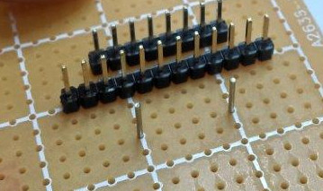
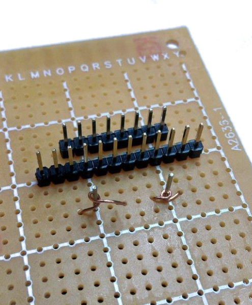
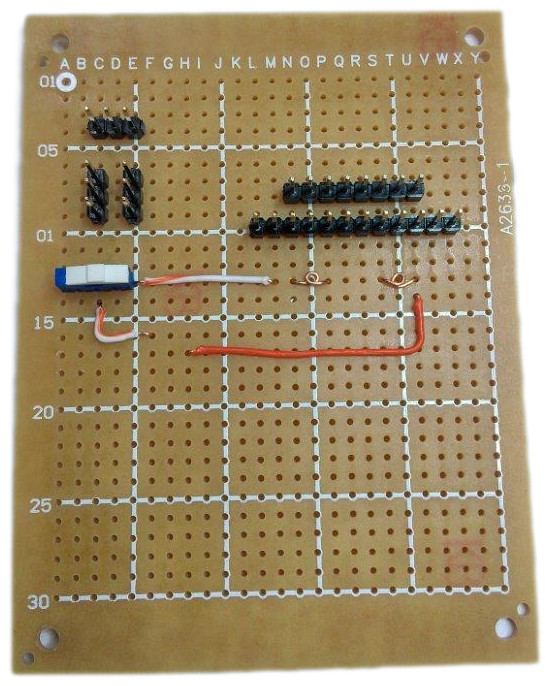
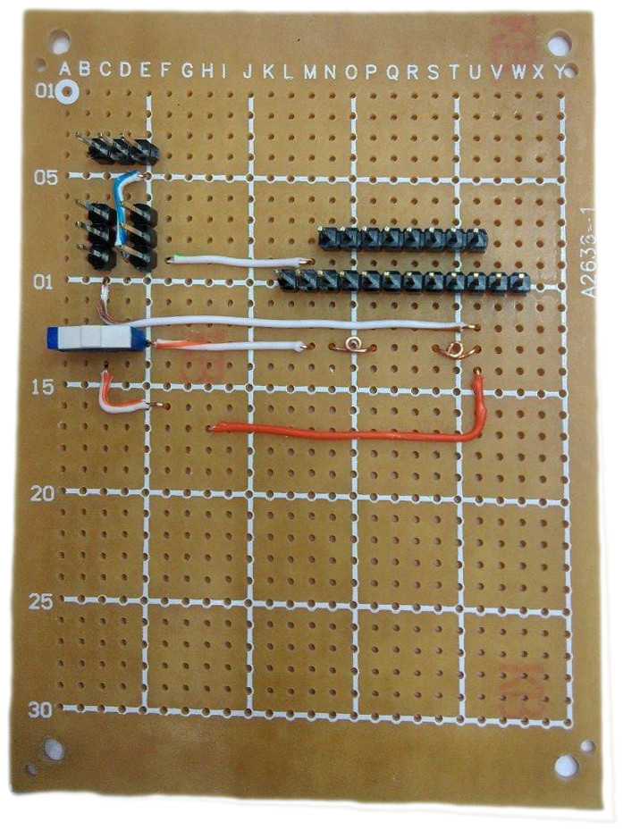

# IR Remote Learner
With our IR Remote Learner kit, you will be able to learn the custom codes of those hard to replace remotes. Running off a 9V battery, this portable unit includes a keypad and well-lit display to make the job easy.									

## Bill of Materials
| Qty | Code | Description |
| --- | --- |---|
|1 | [XC4616](http://jaycar.com.au/p/XC4616) | Nokia Screen
|1 | [XC4426](http://jaycar.com.au/p/XC4426) | Infrared Transmitter
|1 | [XC4427](http://jaycar.com.au/p/XC4427) | Infrared Receiver
|1 | [XC4414](http://jaycar.com.au/p/XC4414) | Arduino Nano
|1 | [HP9550](http://jaycar.com.au/p/HP9550) | PCB Board
|1 | [XC4602](http://jaycar.com.au/p/XC4602) | Touch Keypad
|1 | [PH9235](http://jaycar.com.au/p/PH9235) | 9V Battery Holder
|1 | [SS0834](http://jaycar.com.au/p/SS0834) | Micro slide switch
|1 | [WB2022](http://jaycar.com.au/p/WB2022) | Cat5 solid core cable.
|1 | [HM3212](http://jaycar.com.au/p/HM3212) | 40 Pin header row

###### Optional Extras:
* [WC7709](http://jaycar.com.au/p/WC7709) Mini USB lead for NANO
* [WW4346](http://jaycar.com.au/p/WW4346) Blue Wire wrap (other colours available)

## Software and libraries

The code was developed with these versions, your versions and results may be different.

| Library | Author | Version |
| --- | --- | --- |
| Adafruit_GFX | Adafruit | 1.0.0
| Adafruit_PCD8544 | Adafruit | 1.2.9
| IRRemote | shirriff | 2.2.3
| EEPROM | Arduino | 1.8.5 (with ide) |

## Connection table
| Nano | Module | Pin |  Description
| --- | --- | --- | --- |
| 2 | IR Receiver | S | sense wire for IR receiver module |
| 3 | IR Transmitter | S | Output wire for IR Transmitter |
| 4 | Keypad | SCL | Keypad signal clock |
| 5 | Keypad | SDO | Data Output for Keypad |
| 6 | LCD | DC  | LCD Data select |
| 7 | LCD | RST | LCD reset  |
| 8 | LCD | SCE | LCD chip select  |
| 11 | LCD | DN(MOSI) | LCD SPI Data bus |
| 13 | LCD | CLK | LCD SPI Data clock |

###### Power:

* 5V 
  - [ ] LCD_VCC
  - [ ] IRRecv_VCC (middle pin)
  - [ ] Keypad VCC
  
* GND
  - [ ] LCD_GND
  - [ ] Keypad GND
  - [ ] IRRecv_GND (-) 
  - [ ] IRTrans_GND (-)
  - [ ] 9V Battery Negative
  
* 9V Battery positive rail will connect to the VIN pin on the nano, through the SS0834 micro switch.

## Assembly

#### Components

First step is to remove the header pins from all components (except for nano) as we'll be re-arranging the layout. You can read how to do this on [this tutorial](https://github.com/Jaycar-Electronics/databook/blob/master/tutorials/RemovingHeaders.md)

Also snip header pins into groups of 8, 12, and 3 lots of 3.

#### Battery connector
As we're attaching the battery on the underside of the PCB board, there's a bit of a trick to mount the battery holder.
What we're aiming to do is to make a bit of copper on the top side of the board for the battery connector to solder to.

Firstly, snip and place header row connections as shown below.

Place the battery holder where you want it. I opted to place the power pins along `row 13`.

Right next to the battery pins, we'll place about 4 cm of copper wire (from the ethernet cable, stripped) and solder in place. You can remove the battery holder once you know where you're placing the wires. 

Then place the battery holder back, wrap the copper around the terminals, and place into the hole on the other side of the battery terminals:

When you poke the wire through the other side, place the battery holder back in place and pull on the wires, so that the loop can get tight and flush against the legs.

Poke the wire through and under the battery holder so you can pull on them, and tighten up the loop so it is as small and flush on the top side of the board as you can make it. Remove the battery connector and solder in place without disturbing the copper wire, you should get something like this on the top side of your board:

Now when we're ready to put the battery holder back in, it should slide into the copper loops easily.

#### Power rails

Now we'll start putting in the major power rails. Notice that the 9V battery will connect to the `VIN` pin of the Nano, and everything else will be powered off the 5V pin.

With the battery holder on the underside, this means the left leg of the battery holder (from the top) is the positive 9V. take this to the micro power switch as below:

Then the middle pin of the switch goes to `F16` (with `G16` corresponding to `VIN` of nano)

The Battery negative terminal can just go to `H17` (`G17` corresponds to ground on nano)

Also connect the positive and negative rails from the sensors to where the nano is going.

* `F9 - M9` connects screen GND to IR receiver ground
* `E5 - D9` connects IR transmitter ground to IR receiver ground
* `C10 - U12` connects IR receiver ground to Battery Negative terminal.

Notice in the next picture:

* `M9` connects to a bridge between the screen and keypad ground, `N8` & `M10`
* `E10` (or `F10`) joins down to `E19` - this will be next to the `5V` pin on the nano. (`G19`)
* There is also the green wire from `C4` to `C21` -- this will be bridged to `A21` which is `D3` on the NANO

You can end the wire on any of the pads around the pin that you want, just as long as you don't cover the hole so the arduino nano can pop through and connect.

On the top side, you can place the `B7` to `B20` wire which will connect the receiver to D2, and the `L8` to `G8` wire, which will connect the +5v between the sensor, screen and keypad.

#### Data connections
The rest of the connections can be a bit of a mess but I'll try to go through them one by one so that we can tick them off as we go.

Place in the arduino in the lower corner of the board, you should find that the pins themselves will keep it in place and you shouldn't have to pre-emptively solder it. Make sure the VIN and GND connections are proper while you're at it and rework them if needed.

Make the following connections.

###### Power
* Bridge a connection between `L8`, `L10`, `O8` and `O9`

###### For the Keypad
* SCL `N10` connects to `A22` (which is `D4` on Nano)
* SDO `M10` connects to `A23` (which is `D5` on Nano)

###### For LCD screen
* CLK `Q8` connects to `G30` (which is `D13` on Nano)
* DIN `R8` connects to `A29` (which is `D11` on Nano)
* DC `S8` connects to  `A24` (which is `D6` on Nano)
* SCE `T8` connects to `A26` (which is `D8` on Nano)
* RST `U8` connects to `A25` (which is `D7` on Nano)

#### Mount Components

Now we can mount components. First step is to mount the battery holder to hide that jumble of wires. Poke it through and solder from the topside of the board, then snip the leads so it is as small as possible.

Then mount the keypad to the long row of headers, and snip them down so you can solder the screen in place as well.
Mount the receiver going across the two sets of 3pin headers, and the transmitter on the top row.

## Programming

Programming is simple, just install the libraries and download the arduino code, it should upload with no problems.

## Use

To find a code, power up the unit and point the remote you want to learn from towards the IR receiver (on the side). When the Learner decodes an IR signal, the screen should show a readout of the code interpreted. You can then press any button on the Learner remote to store it into that particular button.

Once the screen has cleared, you can press a button to fire the previously stored remote code

It will remember codes through power cycles / battery changes, as it writes the code to EEPROM.

### Usage notes

This is a very simple basis for IR remote learning; We have found that some remotes such as panasonic or foxtel remotes will display multiple codes all right after each other; this could be due to how large the signal is coming from those remotes and so will have to be modified in the code.

As always, we are looking forward to pull requests. :)

## Future Improvements.

* While it's untested, the wireless modules should provide some additional remote control interfacing.
* This should be able to fit in a 3D printed case if you are so-inclined.
